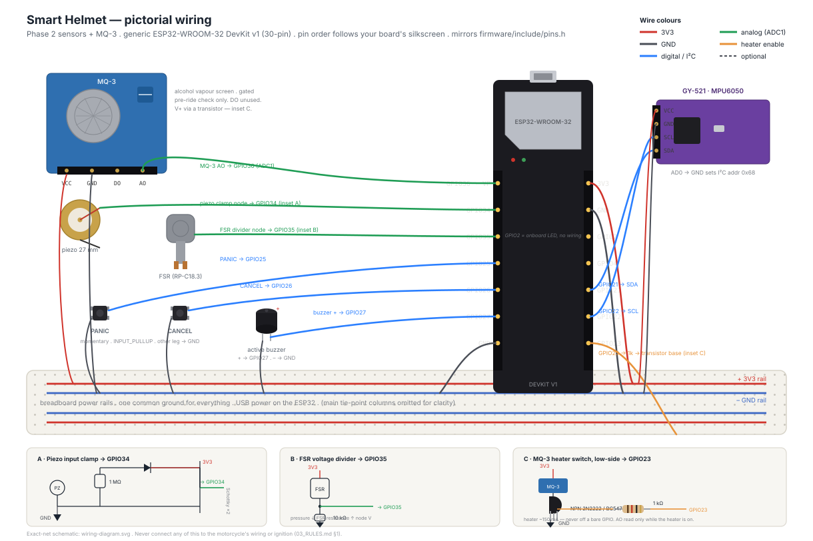
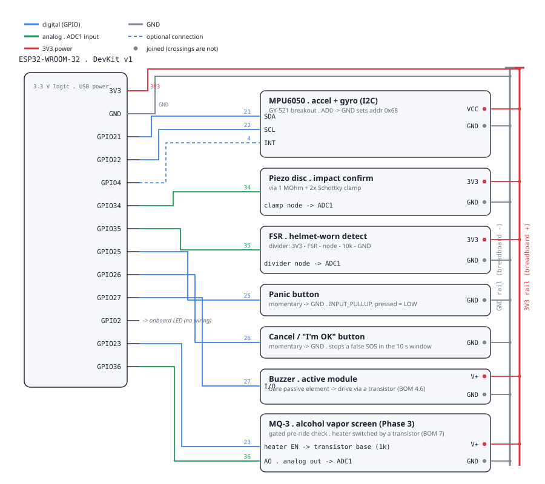

# Phase 2 prototype — wiring

**Diagrams:** [`wiring-pictorial.svg`](wiring-pictorial.svg) (assembly view —
component illustrations + colour-coded wires) and
[`wiring-diagram.svg`](wiring-diagram.svg) (exact-net schematic reference).
**Parts list + full assembly walkthrough:** [`BOM.md`](BOM.md).
This file is the quick pin reference.

Reference board: **generic ESP32 DevKit v1 (30-pin)**. Pin numbers are GPIO
numbers and live in [`../include/pins.h`](../include/pins.h) — edit there if
your board differs, keep this table in sync.

Sensors match the hardware table in `01_REQUIREMENTS.md` §4.1. This build
includes the MQ-3 alcohol sensor (Phase 3) alongside the Phase 2 sensors —
the bare module only; the breath-sampling chamber (mouthpiece / hygiene)
is a separate, still-open physical-design question and is not needed for
bench bring-up. See §"Alcohol pre-ride check" below.

| Component | ESP32 pin | Notes |
|---|---|---|
| MPU6050 SDA | GPIO21 | I²C; 3V3 + GND to the breakout. AD0→GND ⇒ addr `0x68`. |
| MPU6050 SCL | GPIO22 | 4.7 kΩ pull-ups to 3V3 if the breakout lacks them. |
| MPU6050 INT | GPIO4 | optional (data-ready); firmware polls at 50 Hz regardless. |
| Piezo (+) | GPIO34 | through ~1 MΩ to GND (bleed) **and** a Schottky clamp to 3V3 and GND. Input-only ADC1 pin. |
| Piezo (−) | GND | |
| FSR | GPIO35 | FSR from 3V3 to the pin; fixed resistor (~10 kΩ) from the pin to GND (divider). Input-only ADC1 pin. |
| Panic button | GPIO25 → GND | `INPUT_PULLUP`, pressed = LOW. Momentary. Mount where a rider can hit it without looking. |
| Cancel/confirm button | GPIO26 → GND | `INPUT_PULLUP`, pressed = LOW. This is the "I'm OK" button for the 10 s window. |
| Buzzer | GPIO27 | active buzzer (+ to pin, − to GND) or passive via a transistor. |
| Status LED | GPIO2 | onboard LED on most DevKits; solid = BLE linked, blinking = link lost. |
| Battery sense | GPIO32 | optional; divider from VBAT. Set `kVbatWired = true` in `main.cpp` once wired. |
| MQ-3 analog out (AO) | GPIO36 | input-only ADC1 pin (SVP); module's onboard load resistor, no external divider needed. See §"Alcohol pre-ride check" below. |
| MQ-3 heater enable | GPIO23 | GPIO → 1 kΩ → base of a small NPN/MOSFET switching the module's V+ (~150 mA heater). **Do not** wire the heater straight to a GPIO. |

**Power**: bench USB for bring-up. A single-cell LiPo + charger/boost is a
Phase 2 packaging task, not a wiring-diagram item.

**Do not** connect anything here to the motorcycle's electrical system or
ignition. The helmet is electrically isolated from the vehicle by design
(`03_RULES.md` §1, `01_REQUIREMENTS.md` §5).

## ADC notes (ESP32)

- Use **ADC1** pins (GPIO32–39) for piezo/FSR/battery — ADC2 is unavailable
  while Wi-Fi/BLE is active.
- GPIO34/35/36/39 are **input-only** (no internal pull-ups) — fine for the
  analog dividers here.
- The ESP32 ADC is non-linear near the rails; the thresholds in the sensor
  drivers are deliberately loose and get calibrated during bring-up.

## Alcohol pre-ride check (Phase 3, ADR-5)

MQ-3 module VCC through a switch transistor (base via a resistor from
GPIO23, collector/emitter switching the module's power) so the heater
draws nothing between checks — an ESP32 GPIO can't source the ~150 mA an
MQ-3 heater needs. Module's analog output goes straight to GPIO36.

**Per-unit calibration (do this once per physical unit, before its first
pre-ride check):**

1. Flash the firmware, open the serial monitor at 115200 baud.
2. Put the sensor in clean air — away from fuel, hand sanitizer, or
   perfume, all of which the MQ-3 also reacts to.
3. Send the line `CAL`. The firmware warms the heater, averages ~4 s of
   readings once warm, and prints `[CAL] done: valid=1 baseline_adc=...`.
4. The baseline is saved to NVS and survives power cycles. A unit that has
   never run this reports every pre-ride check as `kUncalibrated` — never a
   silent pass (`03_RULES.md` §2).

Re-run `CAL` if the sensor is swapped or a check result looks wrong. The
warm-up duration and the pass/fail ratio (`cfg::mq3` in
`include/build_config.h`) are **PROVISIONAL** placeholders — re-tune them
against real clean-air vs. alcohol-dosed breath samples once hardware
exists (same status as `crash_fusion.cpp`'s thresholds).

The **breath-sampling chamber** (mouthpiece, hygiene handling) is a
separate, still-open physical-design question — none of the above depends
on it being solved; the bare module works for bench bring-up of the
electronics.

## Bring-up order (04_PHASES.md Phase 2)

1. **Panic button + buzzer + cancel button.** Flash, open the serial monitor,
   press panic → you should see `[BTN] panic`, the buzzer pulses for 10 s,
   press cancel → `[BTN] cancel` and a `cancelled` line. This exercises the
   whole SOS state machine with zero other hardware.
2. **MPU6050.** Confirm `MPU6050: ok` at boot. Tip the board over hard while
   tapping the piezo → `crash_impact` SOS.
3. **Piezo.** Tap test; watch `last_impact_peak`.
4. **FSR.** Squeeze → status `helmet_worn` flips to `true`.
5. **BLE.** Pair from `tools/ble_probe.py` or a generic BLE app; watch the
   STATUS notifications and trigger an event.
6. **MQ-3.** Serial `CAL` in clean air for the per-unit baseline (see
   §"Alcohol pre-ride check"), then from `ble_probe.py` press `s`
   (`start_check`) → after the ~20 s warm-up you should see
   `pre_ride_passed` in STATUS flip, or an `alcohol_flag` EVENT if the
   sample is over the baseline ratio.
